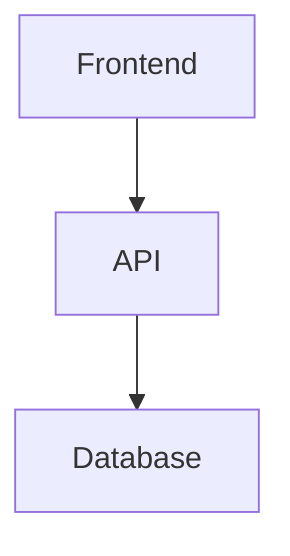

# Documentation App Guidelines (apps/docs)

This document summarizes the technical documentation structure, MDX usage, and content standards of the project prepared using Mintlify.

## 🎯 Overview

The TurboStack documentation is built with **Mintlify** - a modern documentation framework that provides beautiful, interactive documentation with zero configuration.

- **Port**: `4102` (development)
- **URL**: `http://localhost:4102`
- **Framework**: Mintlify
- **Format**: MDX (Markdown + JSX)
- **Last updated**: 2026-01-12

---

## 📁 Project Structure

```
apps/docs/
├── docs.json                 # Mintlify configuration
├── introduction.mdx          # Home page
├── quickstart.mdx            # Quick start guide
├── project-structure.mdx     # Project structure overview
├── api/                      # API documentation
│   ├── elysia.mdx            # Elysia.js framework guide
│   ├── routes.mdx            # Route development
│   ├── authentication.mdx    # Auth implementation
│   ├── email.mdx             # Email service
│   ├── polar.mdx             # Payment integration
│   ├── webhooks.mdx          # Webhook handlers
│   └── upload.mdx            # File upload
├── database/                 # Database documentation
│   ├── prisma.mdx            # Prisma ORM guide
│   ├── schema.mdx            # Schema design
│   └── migrations.mdx        # Migration workflow
├── web/                      # Web documentation
│   ├── nextjs.mdx            # Next.js App Router
│   ├── forms.mdx             # Form handling
│   ├── shadcn-ui.mdx         # UI components
│   └── tailwind.mdx          # Tailwind CSS
├── deployment/               # Deployment guides
│   ├── overview.mdx          # Deployment overview
│   └── vercel.mdx            # Vercel deployment
├── package.json
└── .npmrc
```

---

## 🏗️ Configuration

### docs.json

The `docs.json` file is the main configuration for Mintlify:

```json
{
  "$schema": "https://mintlify.com/docs.json",
  "theme": "maple",
  "name": "TurboStack",
  "description": "Modern fullstack monorepo starter",
  "colors": {
    "primary": "#6366f1",
    "light": "#F8FAFC",
    "dark": "#0F172A"
  },
  "logo": {
    "dark": "/logo-dark.svg",
    "light": "/logo-light.svg",
    "href": "https://turbostack.pro"
  },
  "favicon": "/favicon.svg",
  "navigation": {
    "tabs": [
      {
        "tab": "Documentation",
        "groups": [
          {
            "group": "Getting Started",
            "icon": "rocket",
            "pages": ["introduction", "quickstart", "project-structure"]
          },
          {
            "group": "Backend",
            "icon": "server",
            "pages": ["api/elysia", "api/routes", "api/authentication"]
          }
        ]
      }
    ]
  },
  "footerSocials": {
    "github": "https://github.com/musayazlik/turbostack",
    "twitter": "https://twitter.com/yourusername"
  }
}
```

---

## 📝 Writing Documentation

### MDX File Structure

Every MDX file should have frontmatter:

```mdx
---
title: Page Title
description: Brief description of the page
icon: rocket
---

# Main Heading

Your content here...
```

### Frontmatter Fields

| Field          | Required | Description                    |
| -------------- | -------- | ------------------------------ |
| `title`        | ✅       | Page title (SEO and sidebar)   |
| `description`  | ✅       | Page description (SEO)         |
| `icon`         | ❌       | Icon name (Lucide icons)       |
| `sidebarTitle` | ❌       | Override sidebar display title |

---

## 🎨 Mintlify Components

### Cards

```mdx
<Card title="Quick Start" icon="rocket" href="/quickstart">
  Get started with TurboStack in minutes
</Card>

<CardGroup cols={2}>
  <Card title="API" icon="server" href="/api/elysia">
    Learn about Elysia.js backend
  </Card>
  <Card title="Web" icon="browser" href="/web/nextjs">
    Explore Next.js frontend
  </Card>
</CardGroup>
```

### Code Blocks

````mdx
```typescript
// Code example with syntax highlighting
const app = new Elysia().get("/", () => "Hello World").listen(3000);
```

```bash
# Shell commands
bun install
bun run dev
```
````

### Tabs

````mdx
<Tabs>
  <Tab title="TypeScript">```typescript const greeting = "Hello"; ```</Tab>
  <Tab title="JavaScript">```javascript const greeting = "Hello"; ```</Tab>
</Tabs>
````

### Callouts

```mdx
<Note>This is a note callout with helpful information.</Note>

<Tip>Pro tip for users!</Tip>

<Warning>Be careful with this action.</Warning>

<Info>Additional information here.</Info>
```

### Accordions

```mdx
<AccordionGroup>
  <Accordion title="What is TurboStack?">
    TurboStack is a modern fullstack monorepo starter...
  </Accordion>
  <Accordion title="How do I get started?">
    Run `bun install` to install dependencies...
  </Accordion>
</AccordionGroup>
```

### Frames

```mdx
<Frame>
  
</Frame>
```

### Steps

```mdx
<Steps>
  <Step title="Install dependencies">
    Run `bun install` in the project root
  </Step>
  <Step title="Setup environment">Copy `.env.example` to `.env`</Step>
  <Step title="Start development">Run `bun run dev`</Step>
</Steps>
```

---

## 📚 Content Guidelines

### Writing Style

**DO ✅:**

- Use clear, concise language
- Start with the most important information
- Use code examples liberally
- Include visual aids (diagrams, screenshots)
- Use active voice: "Create a new file" not "A new file should be created"
- Break content into sections with headings
- Add real-world examples and use cases

**DON'T ❌:**

- Use jargon without explanation
- Write long paragraphs without breaks
- Assume prior knowledge
- Skip error cases and edge cases
- Use passive voice

### Code Examples

**Good Example:**

````mdx
## Creating a New Route

Here's how to create a new API endpoint in TurboStack:

```typescript
// src/routes/products.ts
import { Elysia, t } from "elysia";

export const productRoutes = new Elysia({ prefix: "/products" }).get(
  "/",
  async () => {
    // Fetch all products
    const products = await prisma.product.findMany();
    return { success: true, data: products };
  }
);
```
````

Then register the route in `src/index.ts`:

```typescript
import { productRoutes } from "./routes/products";

const app = new Elysia()
  .use(productRoutes) // Add your new route
  .listen(4101);
```

````

### Organization

1. **Start with Overview** - What is this feature/concept?
2. **Show Examples** - Practical, real-world code
3. **Explain Details** - How it works under the hood
4. **Add Best Practices** - Do's and don'ts
5. **Link Related Docs** - Help users find more info

---

## 🔗 Navigation Structure

### Sidebar Organization

Group related pages together:

```json
{
  "group": "Backend",
  "icon": "server",
  "pages": [
    "api/elysia",          // Framework overview
    "api/routes",          // Route development
    "api/auth"             // Authentication
  ]
}
````

### Internal Links

```mdx
<!-- Relative links -->

[Learn about routes](./routes)

<!-- Absolute links -->

[API Guide](/api/elysia)

<!-- External links -->

[Elysia.js Documentation](https://elysiajs.com)
```

---

## 🎯 Page Templates

### Getting Started Page

````mdx
---
title: Feature Name
description: Quick introduction to the feature
icon: star
---

# Feature Name

Brief overview of what this feature does and why it's useful.

## Quick Example

```typescript
// Minimal working example
const example = "code";
```
````

## Step-by-Step Guide

<Steps>
  <Step title="First step">
    Instructions...
  </Step>
</Steps>

## Best Practices

<Tip>
  Pro tips here
</Tip>

## Related Pages

- [Related Feature](./related)
- [Another Feature](./another)

````

### API Reference Page

```mdx
---
title: API Reference
description: Complete API documentation
icon: code
---

# API Name

## Overview

What does this API do?

## Methods

### `methodName(params)`

Description of the method.

**Parameters:**

| Name | Type | Required | Description |
|------|------|----------|-------------|
| `id` | string | Yes | User ID |

**Returns:**

```typescript
{
  success: boolean;
  data: User;
}
````

**Example:**

```typescript
const user = await api.users.get({ id: "123" });
```

````

---

## 🚀 Development Workflow

### Local Development

```bash
# Start Mintlify dev server
cd apps/docs
bun run dev

# Or from root
bun run dev:docs
````

The docs will be available at `http://localhost:4102`

### Hot Reload

Mintlify automatically watches for changes:

- Edit any `.mdx` file
- Save the file
- Browser refreshes automatically

### Adding New Pages

1. **Create MDX file:**

```bash
touch apps/docs/api/new-feature.mdx
```

2. **Add frontmatter:**

```mdx
---
title: New Feature
description: Description of the new feature
icon: sparkles
---

# New Feature

Content here...
```

3. **Add to navigation in `docs.json`:**

```json
{
  "group": "Backend",
  "pages": [
    "api/elysia",
    "api/new-feature" // Add here
  ]
}
```

---

## 📊 Assets and Images

### Adding Images

Store images in the same directory as the MDX file or in a shared directory:

```mdx
<!-- Local image -->


<!-- With Frame component -->

<Frame>
  
</Frame>
```

### Diagrams

Use Mermaid for diagrams:

````mdx

````

````

---

## 🎨 Customization

### Theme Colors

Edit colors in `docs.json`:

```json
{
  "colors": {
    "primary": "#6366f1",     // Brand color
    "light": "#F8FAFC",       // Light mode background
    "dark": "#0F172A"         // Dark mode background
  }
}
````

### Branding

Update logo and favicon:

```json
{
  "logo": {
    "dark": "/logo-dark.svg",
    "light": "/logo-light.svg"
  },
  "favicon": "/favicon.svg"
}
```

---

## 📦 Deployment

### Mintlify Cloud (Recommended)

Mintlify automatically deploys from Git:

1. Push docs to GitHub
2. Connect repo to Mintlify
3. Docs update automatically on push

No build step needed!

### Self-Hosted

For self-hosted deployment, use Docker:

```dockerfile
FROM node:20-alpine

WORKDIR /app

COPY apps/docs/package.json ./
RUN npm install

COPY apps/docs/ ./

EXPOSE 4102

CMD ["npx", "mintlify", "dev", "--port", "4102"]
```

---

## 🧪 Best Practices

### Documentation Maintenance

**DO ✅:**

- Keep docs in sync with code changes
- Update examples when APIs change
- Test all code examples
- Review docs in PR reviews
- Use version numbers for breaking changes
- Add migration guides for updates

**DON'T ❌:**

- Leave outdated examples
- Skip documenting new features
- Use placeholder text
- Forget to test code snippets
- Ignore user feedback

### SEO Optimization

```mdx
---
title: Descriptive Page Title
description: Clear description with keywords (150-160 chars)
---
```

- Use descriptive titles
- Write clear meta descriptions
- Use proper heading hierarchy (H1 → H2 → H3)
- Add alt text to images
- Use internal links

---

## 📚 Common Patterns

### Tutorial Pattern

```mdx
# Building a Feature

Learn how to build X in TurboStack.

## What You'll Build

Brief description of the end result.

## Prerequisites

- Node.js 20+
- Basic TypeScript knowledge

## Step 1: Setup

Instructions...

## Step 2: Implementation

Code and explanations...

## Step 3: Testing

How to test...

## Next Steps

- [Advanced Feature](./advanced)
- [Related Guide](./related)
```

### Troubleshooting Section

```mdx
## Troubleshooting

<AccordionGroup>
  <Accordion title="Error: Module not found">
    **Solution:** Run `bun install` to install dependencies.
  </Accordion>
  <Accordion title="Port already in use">
    **Solution:** Stop other processes or change the port in `.env`
  </Accordion>
</AccordionGroup>
```

---

## 🔧 Useful Tools

### Mintlify CLI Commands

```bash
# Start dev server
mintlify dev

# Check for broken links
mintlify check

# Preview before deploying
mintlify preview
```

### VS Code Extensions

Recommended extensions for writing docs:

- **MDX** - Syntax highlighting for MDX
- **Prettier** - Code formatting
- **Markdown All in One** - Markdown shortcuts
- **Code Spell Checker** - Catch typos

---

## 📚 Related Resources

- [Mintlify Documentation](https://mintlify.com/docs)
- [MDX Documentation](https://mdxjs.com)
- [Lucide Icons](https://lucide.dev) - Icon reference

---

_Last updated: 2026-01-12_
